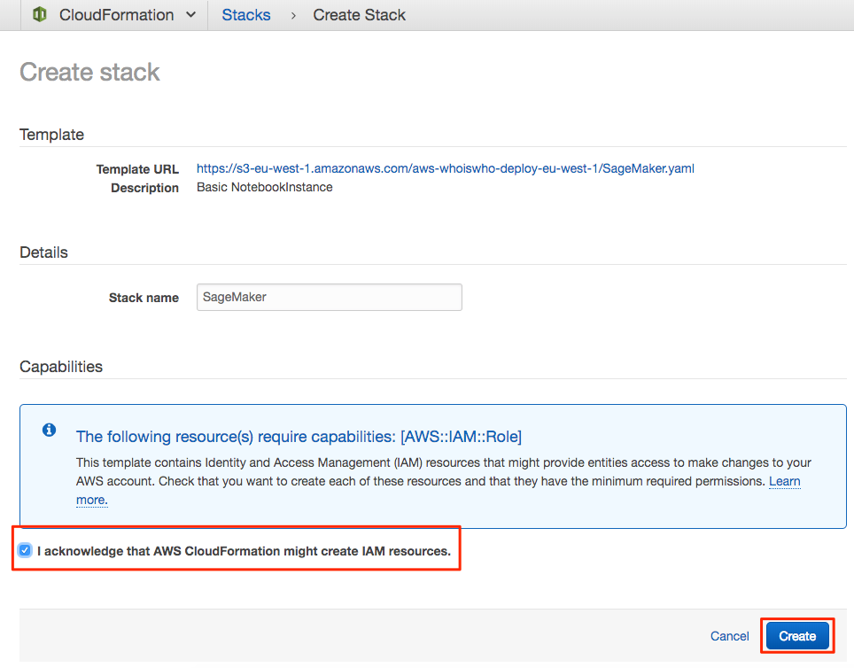
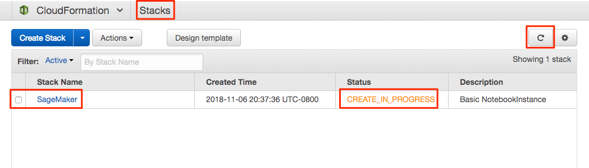
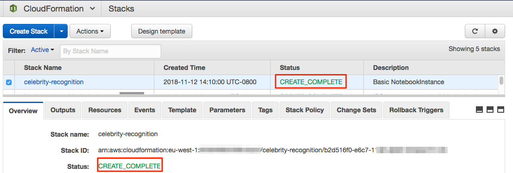
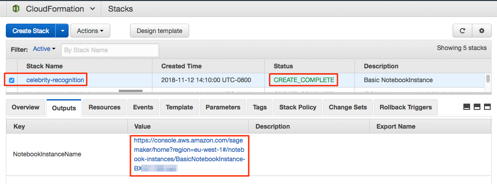
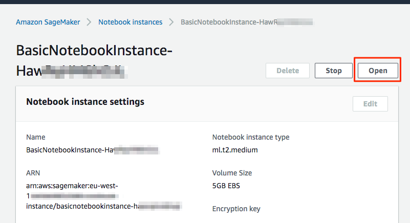
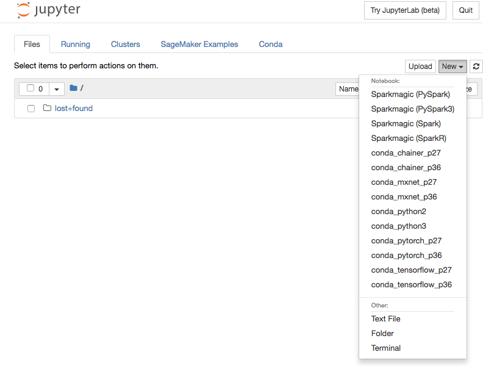
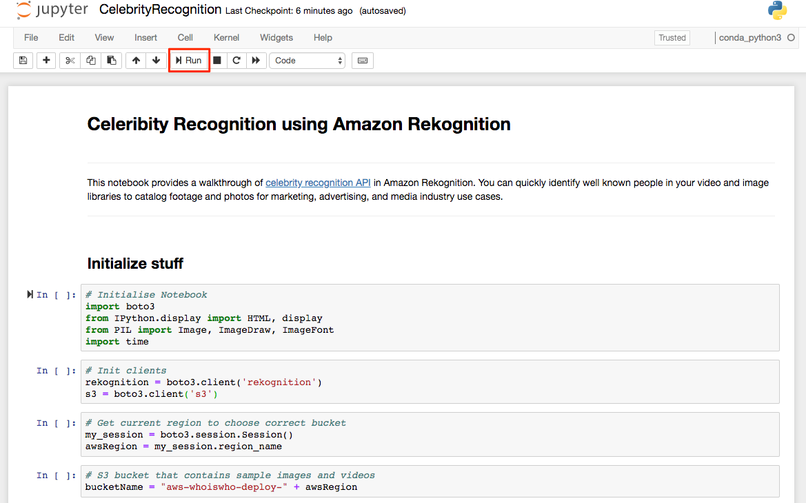
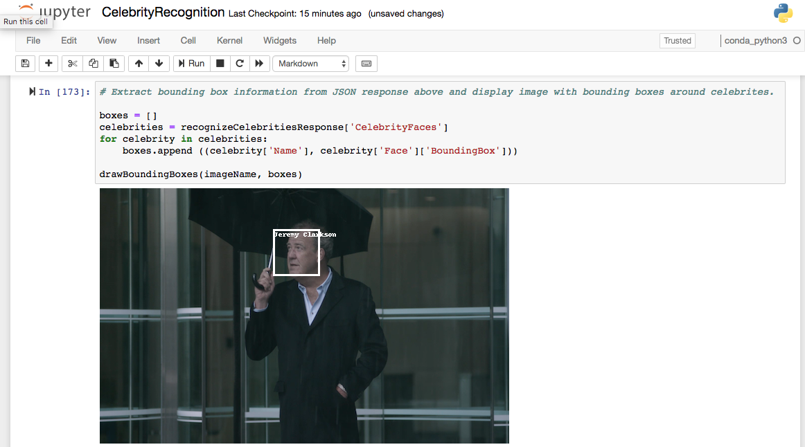
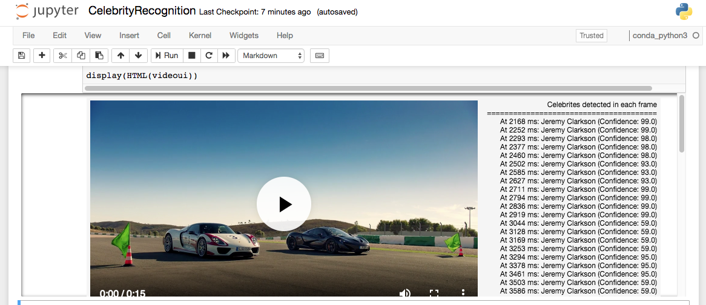

# Celebrity Recognition

In this module you will learn about Celebrity API of Amazon Rekognition which can recognize thousands of celebrities in a wide range of categories, such as entertainment and media, sports, business, and politics. With Amazon Rekognition, you can recognize celebrities in images and in stored videos. You can also get additional information for recognized celebrities.

## Create and Instance to run Jupyter

In this step we will create a SageMaker Notebook instance using CloudFormation template.

In this step we will create a SageMaker Notebook instance using CloudFormation template so we can use Jupyter Notebook to prototype.

***SageMaker or Jupyter Notebook is not required to use Rekognition, but we will use Jupyter as IDE for quick prototyping and to learn various Rekognition APIs.***

1. Click on one of the buttons below to launch CloudFormation template in an AWS region.

Region| Launch
------|-----
US East (N. Virginia) | 
US East (Ohio) | 
US West (Oregon) | 
EU (Ireland) | 

2. Under Create stack, check the checkbox for "I acknowledge that AWS CloudFormation might create IAM resources with custom names" and click Create.

3. You should now see the screen with status CREATE_IN_PROGRESS. Click on the Stacks link in the top navigation and then click Refresh icon to see current CloudFormation stacks.

4. Click on the checkbox next to the stack to see additional details below and wait until CloudFormation stack has the status CREATE_COMPLETE.

## Open SageMaker Instance

1. After CloudFormation template is complete, Click on the Output tab and click on the link for NotebookInstanceName.

2. From your SageMaker instance click on the Open button.

3. You will now be redirected to the Jupyter UI.

4. Click on New and then Terminal.

5. You should now see Terminal like below:

6. In the terminal type:
- cd SageMaker
- git clone https://github.com/darwaishx/celebrity-recognition.git

7. Go back to Jupyter home screen by clicking on the Jupyter logo on the top left and refresh to see the folder celebrity-recognition.

8. Click on celebrity-recognition, then 1-celebrity-recognition and then CelebrityRecognition.ipynb to open the notebook.

9. Follow the directions in the notebook to run each cell and review it's output. You will see celebrities identified in image and video as below.

## Completion
You have successfully used Amazon Rekognition to identify celebrities in images an videos. In the next module, [Recognize Custom Celebrities ](../2-recognize-custom-celebrities), you will learn how to recognize your custom celebrities in the images and videos.
