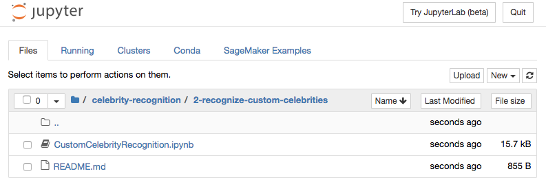
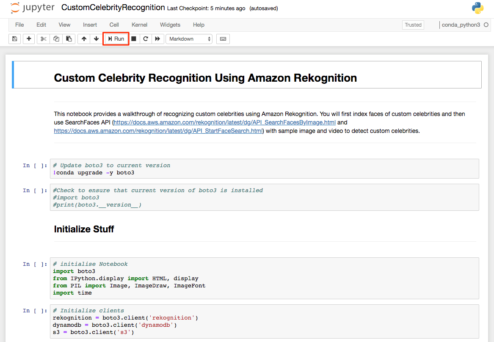
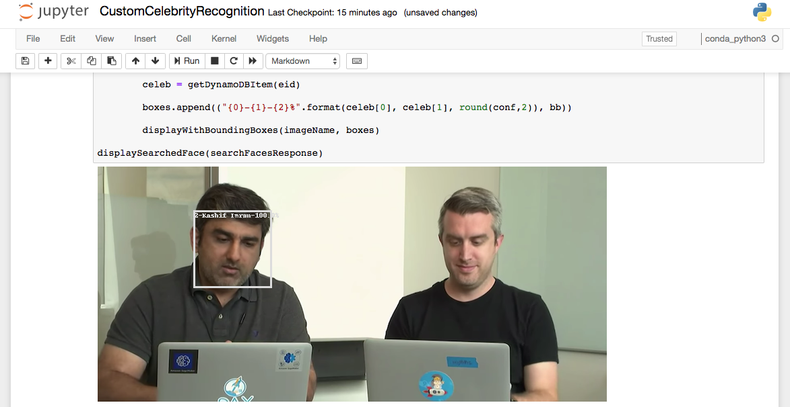
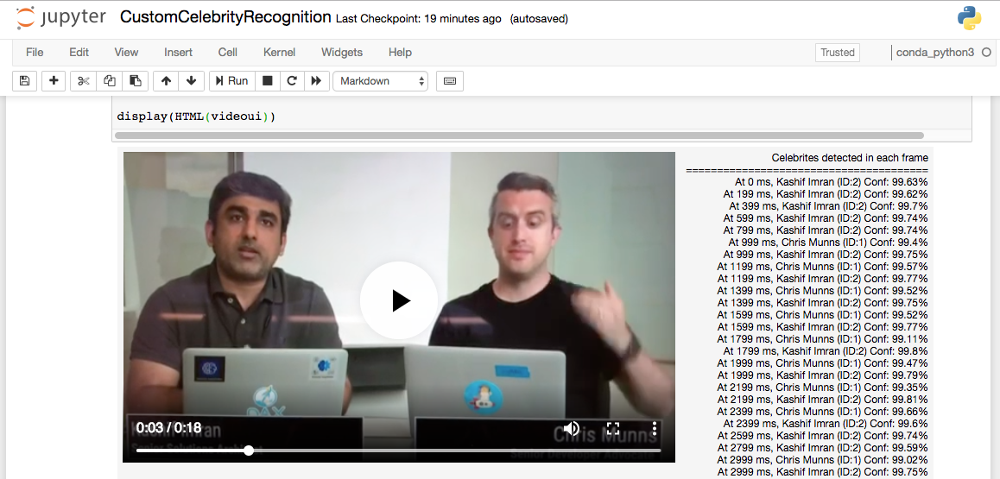

# Recognize Custom Celebrities
In this module you will learn how to use Amazon Rekognition to recognize custom celebrities. You will index faces of custom celebrities and then analyze few images and video to recognize custom celebrities.

1. Open SageMaker instance you created in previous module.

2. From home scree, click on folder celebrity-recognition and then 2-recognize-custom-celebrities.

3. Click on the Jupyter notebook CustomCelebrityRecognition and follow instructions in the notebook.

4. You will see custom celebrities recognized in the image and video as below.

## Completion
You have successfully created Rekognition collection, indexed faces and recognized custom celebrities in images and videos. In the next module, [X-Ray](../3-x-ray), you will learn how to combine both RecognizeCelebrity and SearchFaceByImage to build a Prime Video X-Ray style app which can recognize both mainstream and custom celebrities.
