# X-Ray
In this module we will build an end to end solution like Prime Video X-Ray to recognize mainstream and custom celebrities. We use RecognizeCelebrities and SearchFacesByImage APIs to recognize mainstream and custom celebrities. We will also demonstrate how to analyze a video using Rekognition and identify people in it.

## Pre-requisites
This module requires completion of previous modules:
 - [Celebrity Recognition](https://github.com/darwaishx/celebrity-recognition/tree/master/1-celebrity-recognition)
 - [Recognize Custom Celebrities](https://github.com/darwaishx/celebrity-recognition/tree/master/2-recognize-custom-celebrities)

## Deploy Solution


In this section we will deploy the solution using CloudFormation template. This CloudFormation template will create required resources for this solution including Lambda functions, API Gateway endpoint and a HTML based client to test the solution.

1. Click on **Launch Stack** button below to launch CloudFormation template in US East AWS region.

:warning: **Make sure you launch the Stack in the same region you launched stack in Celebrity Recognition Lab earlier**

Region| Launch
------|-----
US East (N. Virginia) | [](https://console.aws.amazon.com/cloudformation/home?region=us-east-1#/stacks/create/review?stackName=X-Ray&templateURL=https://s3.us-east-1.amazonaws.com/who-is-who-ws-us-east-1/who-is-who-deploy.yaml)
US East (Ohio) | [](https://console.aws.amazon.com/cloudformation/home?region=us-east-2#/stacks/create/review?stackName=X-Ray&templateURL=https://s3.us-east-2.amazonaws.com/who-is-who-ws-us-east-2/who-is-who-deploy.yaml)
US West (Oregon) | [](https://console.aws.amazon.com/cloudformation/home?region=us-west-2#/stacks/create/review?stackName=X-Ray&templateURL=https://s3.us-west-2.amazonaws.com/who-is-who-ws-us-west-2/who-is-who-deploy.yaml)
EU (Ireland) | [](https://console.aws.amazon.com/cloudformation/home?region=eu-west-1#/stacks/create/review?stackName=X-Ray&templateURL=https://s3.eu-west-1.amazonaws.com/who-is-who-ws-eu-west-1/who-is-who-deploy.yaml)

2. Under Create stack, check both checkboxes for **I acknowledge that AWS CloudFormation might create IAM resources with custom names** and click **Create** button.

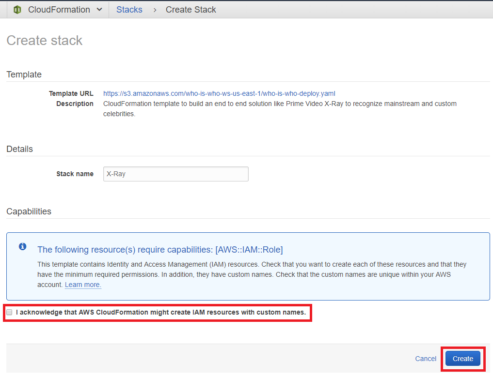

3. You should now see the screen with status **CREATE_IN_PROGRESS**. Click on the **Stacks** link in the top navigation to see current CloudFormation stacks.

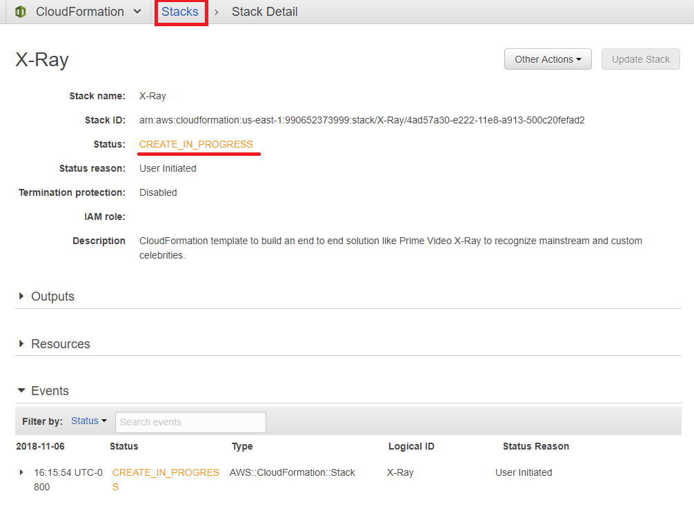

5. Click on the checkbox next to the stack to see additional details below.


6. Wait until CloudFormation stack status changes to  **CREATE_COMPLETE**.


7. Click on **Outputs** tab to view the details of Lambda function, API Gateway APIs and Client HTML file created by CloudFormation.


8. Copy and paste these variable in a text editor of your choice on your local machine for reference. We will use the value of these variables in next steps and sections.

9. Click the **bucketURL** link to load the client HTML page hosted from your S3 bucket.


10. Following is the UX for Client HTML. You will notice that when you click on **Recognize Celebrities** button, an error is displayed **Error: Invalid API endpoint. Please configure the correct endpoint.**.

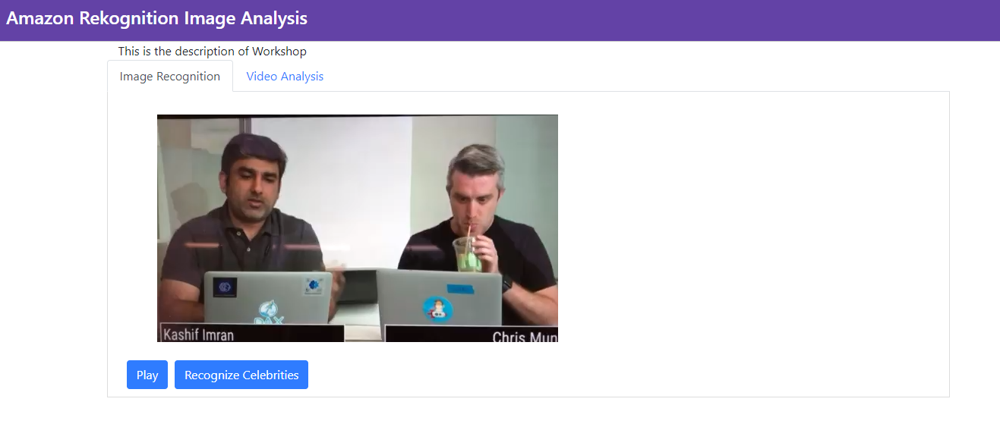

## Verify Lambda environment variables
In this section we need to verify that environment variables defined in Lambda function are set to correct values i.e. pointing to right DynamoDB table and custom Rekognition collection created in previous lab.

1. Go to AWS Lambda in AWS Console at https://console.aws.amazon.com/lambda/

2. Enter your CloudFormation Stack name in the Search text box and press **Enter** key. This will show a list of functions. Click on the function name ending in **-ImageRecognition**

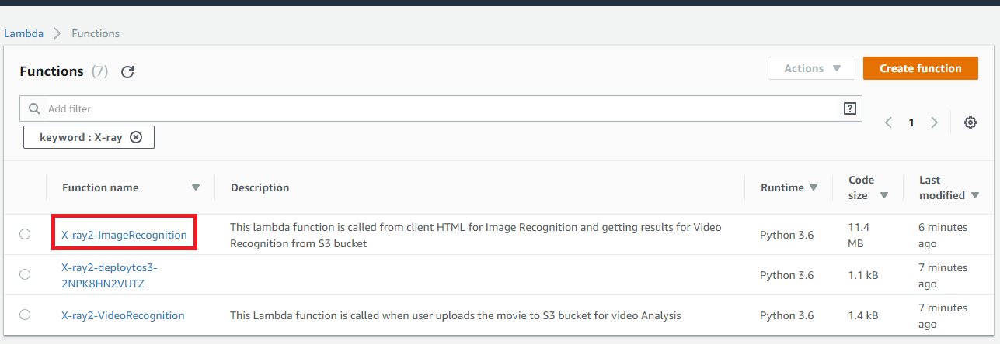

3. Scroll down to see **Environment variables** section. Verify if the environment variables **dynamodbTable** and **rekCollectionName** point to correct values. **dynamodbTable** should point to the DynamoDB Table you created in your previous lab to store custom celebrity data. **rekCollectionName** should point to the custom Rekognition Collection you created in the previous lab.

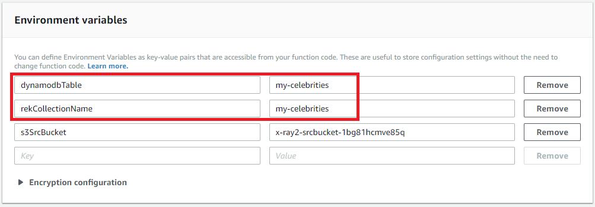

4. Repeat Step 1 to 3 for the Lambda function ending in **-VideoRecognition**

## Upload video file to S3 bucket
Part of this workshop is to demonstrate how we can analyze a video file using Rekognition. In this step, we will upload a video file to a S3 bucket. This will trigger  **-VideoRecognition** Lambda function to submit the video file to Rekognition for identification of mainstream and custom celebrities using **StartCelebrityRecognition** and **StartFaceSearch** APIs. Result of this analysis will be stored in S3 bucket for later consumption from our Client HTML page.

1. Download the [video file](https://s3-us-west-2.amazonaws.com/ki-rekognition-content-uw2/serverless-bytes.mov) and save it locally.

2. Go to the CloudFormation console [https://console.aws.amazon.com/cloudformation/home](https://console.aws.amazon.com/cloudformation/home)

3. Click the checkbox next to the stack you created in this lab (default:X-ray). 

4. Select **Resources** tab from the bottom pane and navigate to **SrcBucket** under **Logical ID** column. Click on the hyperlink for the S3 bucket (under **Physical ID** column) to open the S3 bucket. 

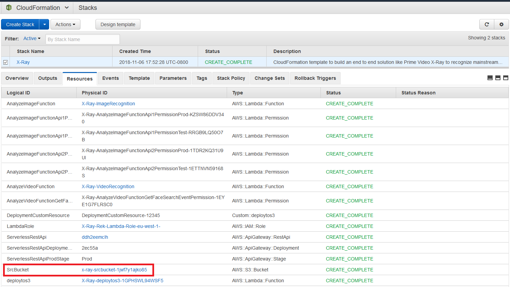

5. Click on **Upload** button.

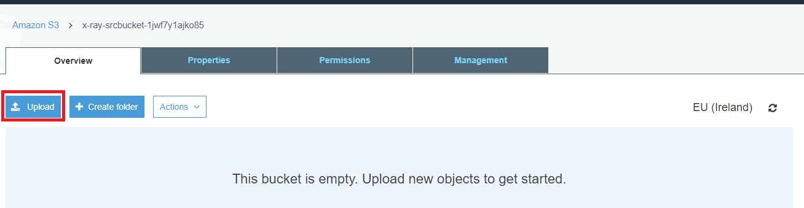

6. Click on **Add Files** button and select **serverless-bytes.mov** video in file selection dialog from your local machine **OR** drag and drop **serverless-bytes.mov** file on the **Upload** dialog box.

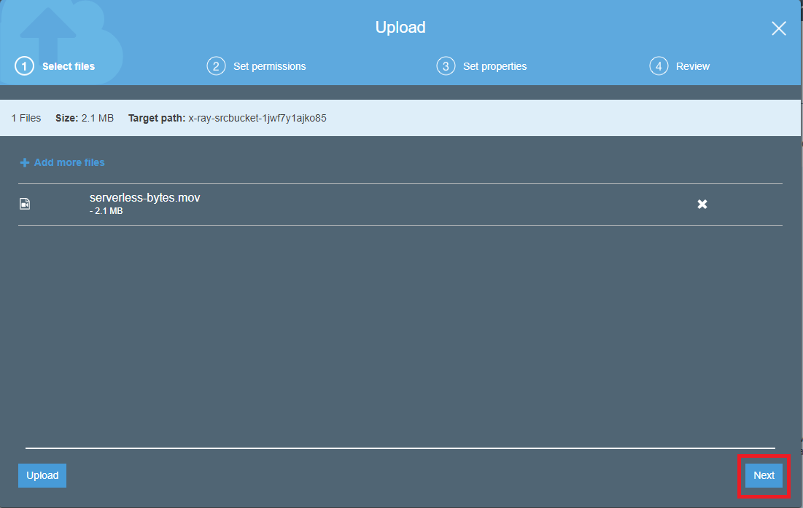

7. Click the **Next** button, click **Next** on **Set permissions** and **Set properties** screens and finally click the **Upload** button on **Review** screen to upload the file to S3 bucket.

8. As soon as the file is uploaded, S3 will trigger **-VideoRecognition** Lambda function. It will submit the file to AWS Rekognition for analysis and finally save the JSON result of that analysis to this same bucket as **serverless-bytes.mov-results.json**. In 3-4 minutes, refresh the bucket to see the JSON file appear in S3 bucket.

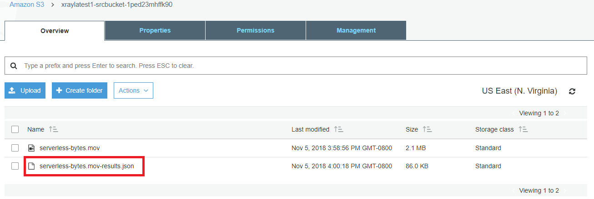

## Modify HTML Client
In this section we will modify the HTML Client to point it to the REST endpoint service we have deployed on API Gateway using CloudFormation.

1. Copy the value of **S3BucketHTML** variable from the reference variables you copied to text editor in **Step 8** of previous section **OR** Repeat **Step 7** of previous section and copy the value for **S3Bucket** from **Outputs**.

2. Go to Amazon S3 in AWS Console at https://s3.console.aws.amazon.com/s3/

3. Type the name of S3 bucket copied in **Step 1** in **Search for buckets** textbox. It will display the bucket in the list. Click on the Bucket name as shown in this screen shot.


4. Contents of this S3 bucket will have **xray.html** file. Click on **xray.html** file.


5. Click on **Download** button and save **xray.html** to your local machine.


6. Open **xray.html** on your local machine using a text editor of your choice. Search for the following line in **xray.html** code. We need to update **apiGatewayHost** to point to API Gateway host.
```
var apiGatewayHost = 'TODO: Enter API Gateway Host';

```
7. We need to get the REST endpoint from API Gateway. Go to Amazon API Gateway in AWS Console at https://console.aws.amazon.com/apigateway/.

8. API will be named the same as your CloudFormation stack name. Click on the API in the left menu under **API** section.

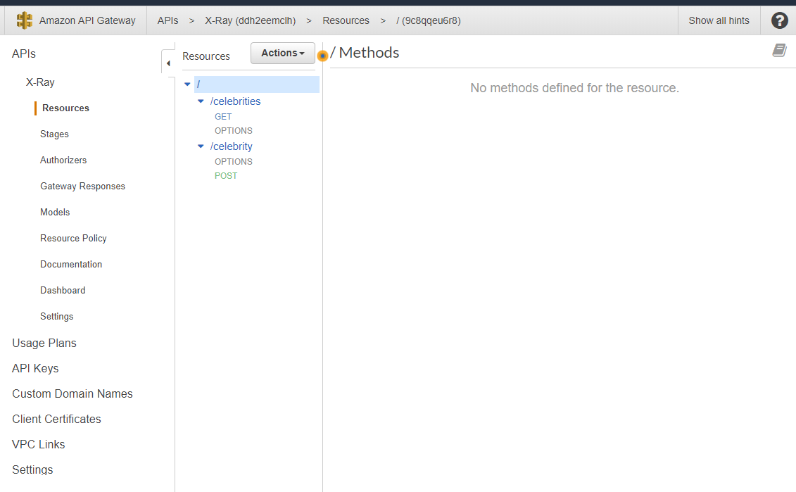

9. As shown in following screen shot, click on **Stages** in left menu under your **API** name. Then click **Prod**. Copy the API Gateway host from **Invoke URL**. This is the endpoint your Client HTML variable **apiGatewayHost** should point to. Follow the click sequence as numbered in following screen shot. Underlined text in red is API Gateway host. Make sure you just copy the host and not the whole URL.

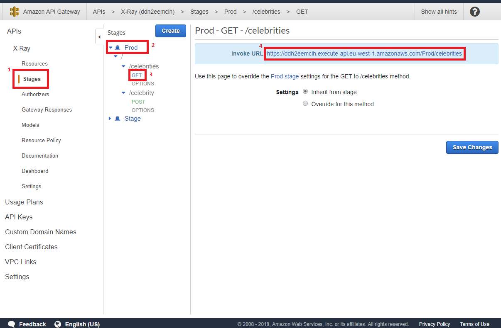

10. Go to the text editor on your local machine where **xray.html** was being edited in **Step 6**. Replace the text **var apiGatewayHost =TODO: Enter API Gateway Host** with the recently copied API Gateway host from **Step 9**.
```
apiGatewayHost = 'ub55zz2yhi'
```

13. Save the file **xray.html**.

## Upload xray.html to S3 bucket

1. Go to Amazon S3 in AWS Console at https://s3.console.aws.amazon.com/s3/

2. Type the name of S3 bucket copied in **Step 1** in **Search for buckets** textbox. It will display the bucket in the list. Click on the Bucket name as shown in this screen shot.


3. Click on **Upload** button.


4. Click on **Add Files** button and select **xray.html** in the file selection dialog from your local machine **OR** drag and drop **xray.html** file on the **Upload** dialog box.


5. Click on **Next** button to proceed to **Set permissions**. Select **Grant public read access to this object(s)** from **Manage public permissions** drop-down menu. Click **Next** button.


6. Click **Next** button on **Set properties** screen.

7. Review and click **Upload** on **Review** screen.

## Test the solution

1. Access your hosted client HTML page again.

 **Hint:** if you don't have the URL, you can get it from CloudFormation Stack **bucketURL** Output variable  **OR** Repeat **Step 7** of [Deploy Solution](#deploy-solution) and copy the value for **bucketURL** from **Outputs**.

2. Click on **Play** button. Once the video starts playing, click on **Recognize Celebrities** button. Video will pause and you will see red boxes with the names of identified celebrities by Amazon Rekognition. 

3. Click on **VIdeo Analysis** tab and  click **Recognize Celebrities** button. The video will start playing and identified celebrities will be marked in red boxes.

## Completion
You have successfully created Amazon Prime X-Ray feature using AWS Rekognition, AWS Lambda, API Gateway. This solution recognizes mainstream celebrities as well as custom celebrities.

## Clean up
1. Delete the 2 S3 buckets created in this solution.
2. Go to the CloudFormation console [https://console.aws.amazon.com/cloudformation/home](https://console.aws.amazon.com/cloudformation/home) 
3. Select the checkbox next to the Stack Name we created.
4. Click on **Actions** button and select **Delete Stack**
5. Refresh the section in 3-4 minutes to make sure stack is deleted.